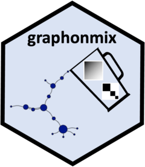

<!-- README.md is generated from README.Rmd. Please edit that file -->

```{r, include = FALSE}
knitr::opts_chunk$set(
  collapse = TRUE,
  comment = "#>",
  fig.path = "man/figures/README-",
  out.width = "100%"
)
```

# graphonmix <a href="https://sevvandi.github.io/graphonmix/"></a>

 <!-- badges: start -->
  [](https://github.com/sevvandi/graphonmix/actions/workflows/R-CMD-check.yaml)
  <!-- badges: end -->

The goal of graphonmix is to generate dense or sparse graphs via different techniques. We explore $(U,W)$-mixture graphs and graphettes. $(U,W)$-mixture graphs are generated from a standard dense graphon $W$ and a disjoint clique graphon $U$, which acts as the sparse graph generator. Graphettes are a triple consisting of a graphon $W$, a sparsifing sequence $\{\rho_n\}_n$ with $\rho_n \to 0$ and graph edit function $f$.   $(U,W)$-mixture graphs are discussed in [@SKCS2025graphon] and graphettes are discussed in [@wijesinghe2026flowette]. 

## Installation

You can install the development version of graphonmix from [GitHub](https://github.com/) with:

``` r
# install.packages("pak")
pak::pak("sevvandi/graphonmix")
```

## $(U,W)$ Mixture Example 

This is a basic example on how to sample a $(U,W)$-mixture graph.

```{r example}
library(graphonmix)
library(igraph)
# create the dense graphon W(x,y) = 0.1
W <- matrix(0.1, nrow = 100, ncol = 100)
# create the sparse part - a disjoint set of stars
wts <- c(0.5, 0.3, 0.2)
# single function to generate a graph mixture
gr1 <- sample_mixed_graph(W, wts, nd = 100, ns = 300, p = 0.5, option = 2)
plot(gr1,
     edge.curved = 0.3,
     vertex.size = degree(gr1)*0.1,
     edge.color = "lightgray",     # Light colored edges
     vertex.label = NA,
     vertex.color = "lightblue",
     main = "(U,W) Graph mixture"
)
```

<!-- Or you can generate the two graphs separately and join them.  -->

<!-- ```{r} -->
<!-- # sample the dense part and plot -->
<!-- grdense <- sample_graphon(W, 100) -->
<!-- plot(grdense, -->
<!--      edge.curved = 0.3, -->
<!--      vertex.size = degree(grdense)*0.1, -->
<!--      edge.color = "lightgray",     # Light colored edges -->
<!--      vertex.label = NA, -->
<!--      vertex.color = "lightblue", -->
<!--      main = "Dense Part" -->
<!-- ) -->

<!-- # sample the sparse part and plot -->
<!-- grsparse <- generate_star_union(wts, 300) -->
<!-- plot(grsparse, -->
<!--      edge.curved = 0.3, -->
<!--      vertex.size = degree(grsparse)*0.1, -->
<!--      edge.color = "lightgray",     # Light colored edges -->
<!--      vertex.label = NA, -->
<!--      vertex.color = "lightblue", -->
<!--      main = "Sparse Part" -->
<!-- ) -->

<!-- # join the two graphs and plot -->
<!-- gr2 <- graph_join(grdense, grsparse, option = 2) -->
<!-- plot(gr2, -->
<!--      edge.curved = 0.3, -->
<!--      vertex.size = degree(gr2)*0.1, -->
<!--      edge.color = "lightgray",     # Light colored edges -->
<!--      vertex.label = NA, -->
<!--      vertex.color = "lightblue", -->
<!--      main = "(U,W) Graph mixture" -->
<!-- ) -->
<!-- ``` -->

## Graphette example

This is an example with $\rho_n = 10/n$ and $f = \text{star_f1}$. The graph edit function $\text{star_f1}$ adds stars using a Poisson process. 

```{r}
rho <- function(n) 20/n
gr <- sample_graphette(W, 
                       rho_n = rho, 
                       graph_edit_f = 'star_f1',
                       n = 200,
                       t_or_p = 2)

plot(gr, vertex.label = NA, vertex.size = 3)

```


## Acknowledgements
A big thank you to Sashenka Fernando for helping me with the hex sticker. 

## References
