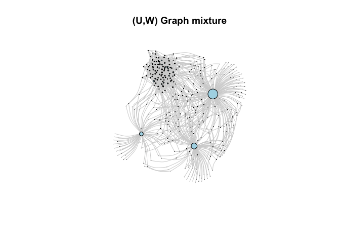
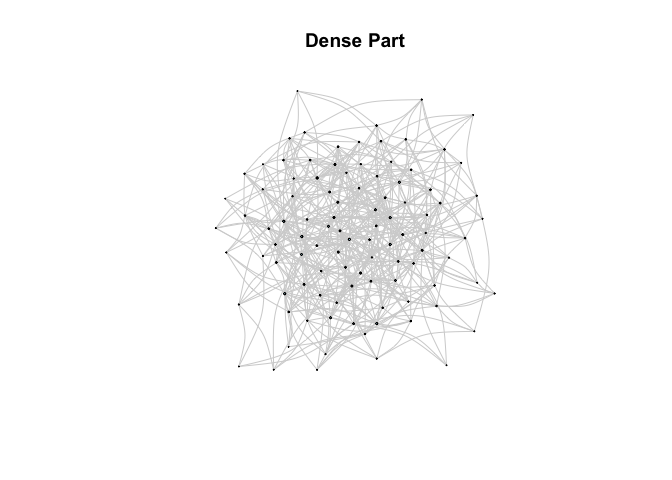
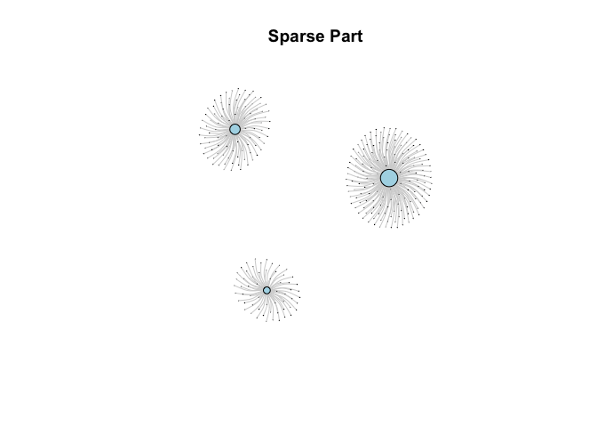

<!-- README.md is generated from README.Rmd. Please edit that file -->

# graphonmix <a href="https://sevvandi.github.io/graphonmix/"></a>

<!-- badges: start -->
[](https://github.com/sevvandi/graphonmix/actions/workflows/R-CMD-check.yaml)
<!-- badges: end -->

The goal of graphonmix is to generate $(U,W)$-mixture graphs. These
graphs are generated from a standard dense graphon $W$ and a disjoint
clique graphons $U$, which acts as the sparse graphon. More details can
be found at (Kandanaarachchi and Ong 2025).

## Installation

You can install the development version of graphonmix from
[GitHub](https://github.com/) with:

``` r
# install.packages("pak")
pak::pak("sevvandi/graphonmix")
```

## Example

This is a basic example on how to sample a $(U,W)$-mixture graph.

``` r
library(graphonmix)
library(igraph)
#> 
#> Attaching package: 'igraph'
#> The following objects are masked from 'package:stats':
#> 
#>     decompose, spectrum
#> The following object is masked from 'package:base':
#> 
#>     union
# create the dense graphon W(x,y) = 0.1
W <- matrix(0.1, nrow = 100, ncol = 100)
# create the sparse part - a disjoint set of stars
wts <- c(0.5, 0.3, 0.2)
# single function to generate a graph mixture
gr1 <- sample_mixed_graph(W, wts, nd = 100, ns = 300, p = 0.5, option = 2)
plot(gr1,
     edge.curved = 0.3,
     vertex.size = degree(gr1)*0.1,
     edge.color = "lightgray",     # Light colored edges
     vertex.label = NA,
     vertex.color = "lightblue",
     main = "(U,W) Graph mixture"
)
```



Or you can generate the two graphs separately and join them.

``` r
# sample the dense part and plot
grdense <- sample_graphon(W, 100)
plot(grdense,
     edge.curved = 0.3,
     vertex.size = degree(grdense)*0.1,
     edge.color = "lightgray",     # Light colored edges
     vertex.label = NA,
     vertex.color = "lightblue",
     main = "Dense Part"
)
```



``` r

# sample the sparse part and plot
grsparse <- generate_star_union(wts, 300)
plot(grsparse,
     edge.curved = 0.3,
     vertex.size = degree(grsparse)*0.1,
     edge.color = "lightgray",     # Light colored edges
     vertex.label = NA,
     vertex.color = "lightblue",
     main = "Sparse Part"
)
```



``` r

# join the two graphs and plot
gr2 <- graph_join(grdense, grsparse, option = 2)
plot(gr2,
     edge.curved = 0.3,
     vertex.size = degree(gr2)*0.1,
     edge.color = "lightgray",     # Light colored edges
     vertex.label = NA,
     vertex.color = "lightblue",
     main = "(U,W) Graph mixture"
)
```


## Acknowledgements

A big thank you to Sashenka Fernando for helping me with the hex
sticker.

## References

<div id="refs" class="references csl-bib-body hanging-indent"
entry-spacing="0">

<div id="ref-SKCS2025graphon" class="csl-entry">

Kandanaarachchi, Sevvandi, and Cheng Soon Ong. 2025. “Graphon Mixtures.”
*arXiv Preprint arXiv:2505.13864*.

</div>

</div>
